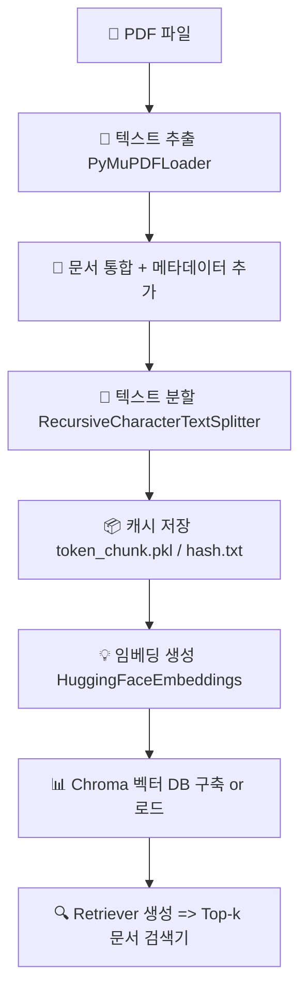
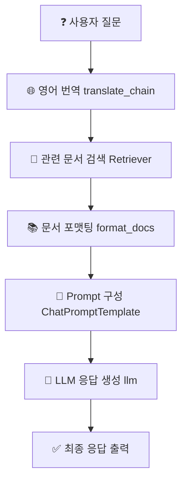

# 📊 데이터 흐름도: LangChain 기반 RAG 시스템

이 프로젝트는 PDF 문서를 벡터 DB로 저장하고,  
사용자의 질문을 LLM으로 응답하는 **RAG(Retrieval-Augmented Generation)** 파이프라인입니다.

---

## 📂 데이터 처리 흐름 (벡터 DB 구축)
 





---

## 🧪 주요 구성 요소 설명

| 구성 요소 | 설명 |
|-----------|------|
| `setup_vector_db()` | PDF → 텍스트 추출 → 분할 → 임베딩 → Chroma 저장 |
| `get_retriever()` | Chroma에서 유사 문서 검색하는 Retriever 객체 생성 |
| `translate_chain` | 한국어 질문을 영어로 번역 |
| `retriever | format_docs` | 관련 문서 검색 후 문자열로 정리 |
| `prompt` | 질문과 context 기반 Prompt 구성 |
| `llm | StrOutputParser()` | LLM에 요청하고, 응답 파싱 |
| `rag_chain.batch(questions)` | 여러 질문을 일괄 처리 |

---

## 💬 예시 질문 목록

```python
questions = [
    "Exaone 언어 모델이 다른 모델과 다른 점은 무엇인가요?",
    "Phi-3 언어 모델은 어떤 데이터로 학습했나요?",
    "Qwen 2 의 다국어 성능은 어떻게 나타났나요?",
    "Gemma 의 스몰 모델은 어떻게 학습했나요?",
]
```

---

## ✅ 예시 응답 형식

```text
Q : Exaone 언어 모델이 다른 모델과 다른 점은 무엇인가요?
A : Exaone은 멀티모달 데이터를 함께 학습하여 한국어와 이미지 이해에 강점을 갖습니다.
--------------------------------------------------
Q : Phi-3 언어 모델은 어떤 데이터로 학습했나요?
A : 고품질 synthetic 교육 데이터를 기반으로 학습되었습니다.
```

---

## 📦 의존 패키지 설치 예시

```bash
pip install langchain langchain-core langchain-community langchain-chroma
pip install langchain-huggingface sentence-transformers
pip install groq  # Groq 모델 사용 시
```

---
 
# 📘 Contextual Retrieval 기반 RAG 시스템

이 프로젝트는 PDF 문서에서 정보를 추출하고,  
LangChain과 HuggingFace 임베딩 모델, LLM을 사용하여  
**자연어 질문에 대한 정확한 답변**을 생성하는 RAG (Retrieval-Augmented Generation) 파이프라인입니다.

---

## 🔧 주요 구성 요소

### 1. 📄 문서 처리 및 벡터화

- `./papers/*.pdf` 경로에 있는 PDF 문서들을 로드합니다.
- `PyMuPDFLoader`를 통해 페이지별 텍스트를 추출하고,
- `RecursiveCharacterTextSplitter`로 2000자 단위로 문서를 분할합니다.
- 각 Chunk에 대해 **문맥(Context)** 요약을 LLM으로 생성해 앞부분에 삽입합니다.
- 임베딩은 `sentence-transformers/all-MiniLM-L6-v2` 모델을 사용하여 생성합니다.
- 결과는 `Chroma` 벡터스토어에 저장 (`./chroma_papers_contextual_retrieval` 디렉토리).

---

### 2. 🔍 하이브리드 검색 (Ensemble Retriever)

- `BM25Retriever`와 `Chroma`의 벡터 기반 검색기를 조합하여 **정확성과 커버리지를 동시에 확보**합니다.
- 두 검색기의 결과를 `EnsembleRetriever`를 통해 조합합니다.

```python
ensemble_retriever = EnsembleRetriever(
    retrievers=[bm25_retriever, vector_retriever],
    weights=[0.5, 0.5]
)
```

---

### 3. 🌐 번역 → 검색 → 요약

- 사용자의 질문은 `translate_chain`을 통해 **영어로 변환**됩니다. (LLM 정확도 향상 목적)
- 변환된 질문을 `ensemble_retriever`로 검색
- 검색된 문서를 `format_docs()` 함수로 포맷
- `ChatPromptTemplate`을 통해 최종 프롬프트 구성 후 LLM으로 응답 생성

```python
rag_chain = (
    {
        "context": translate_chain | retriever | format_docs,
        "question": RunnablePassthrough(),
    }
    | prompt
    | llm
    | StrOutputParser()
)
```

---

## 🧪 실행 예시

```python
questions = [
    "Exaone 언어 모델이 다른 모델과 다른 점은 무엇인가요?",
    "Phi-3 언어 모델은 어떤 데이터로 학습했나요?",
    ...
]
result = rag_chain.batch(questions)
```

---

## 🗃️ 캐싱 및 최적화

- 문서 해시는 `pdf_hash.txt`로 저장되며, 변경 없을 시 기존 캐시(`token_chunk.pkl`) 사용
- context 생성은 실패 시 에러 메시지를 출력하며 빈 문자열로 대체됩니다.
- Embedding 결과는 `Chroma`에 저장되어 재사용됩니다.

---

## 🧠 사용 모델 요약

| 기능 | 모델 / 도구 |
|------|--------------|
| 문서 임베딩 | `sentence-transformers/all-MiniLM-L6-v2` |
| 검색 | Chroma + BM25 조합 |
| 번역 | Groq LLM (예: llama-3) |
| 질문 응답 | Groq LLM (예: llama-3) |
| 문맥 요약 | Groq LLM (Context 생성) |

---

## 📂 디렉토리 구조

```
📁 papers/                     # PDF 문서 저장 경로
📁 chroma_papers_contextual_retrieval/  # Chroma DB 저장소
📄 vector_db.py                # Vector DB 및 Retriever 생성 로직
📄 query.py                    # RAG 파이프라인 실행
```

---

## ⚠️ 주의 사항

- `server.py`에 정의된 `llm`은 반드시 전역으로 공유 가능한 LLM 인스턴스여야 합니다.
- LangChain 버전이 0.2 이상일 경우, `BM25Retriever`는 `langchain_community.retrievers`에서 import 해야 합니다.
- GPU 가속이 필요한 경우 `device="cuda"` 옵션 확인하세요.

---

## ✅ 결과 예시

```
Q : Phi-3 언어 모델은 어떤 데이터로 학습했나요?
A : Phi-3 모델은 다양한 도메인의 오픈 데이터셋을 활용해 학습되었으며, 코드, 수학, 다국어 데이터가 포함됩니다.
==================================================
```

---

## 🧩 향후 확장 아이디어

- 🔐 PDF 내 인증된 섹션만 필터링
- 💬 Streaming 답변
- 📉 Context 압축 최적화 추가 (예: `LLMChainExtractor`)
- 📌 메타데이터 기반 필터링 (날짜, 출처 등)

---

> 만든 이: 정다훈  
> 최신 업데이트: 2025년 4월

---
