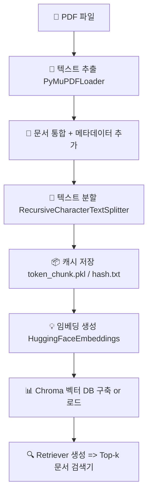
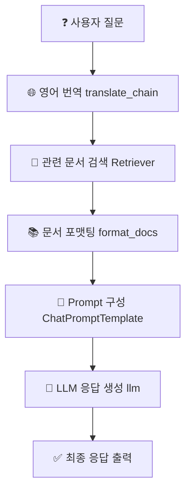

# 📊 데이터 흐름도: LangChain 기반 RAG 시스템

이 프로젝트는 PDF 문서를 벡터 DB로 저장하고,  
사용자의 질문을 LLM으로 응답하는 **RAG(Retrieval-Augmented Generation)** 파이프라인입니다.

---

## 📂 데이터 처리 흐름 (벡터 DB 구축)
 





---

## 🧪 주요 구성 요소 설명

| 구성 요소 | 설명 |
|-----------|------|
| `setup_vector_db()` | PDF → 텍스트 추출 → 분할 → 임베딩 → Chroma 저장 |
| `get_retriever()` | Chroma에서 유사 문서 검색하는 Retriever 객체 생성 |
| `translate_chain` | 한국어 질문을 영어로 번역 |
| `retriever | format_docs` | 관련 문서 검색 후 문자열로 정리 |
| `prompt` | 질문과 context 기반 Prompt 구성 |
| `llm | StrOutputParser()` | LLM에 요청하고, 응답 파싱 |
| `rag_chain.batch(questions)` | 여러 질문을 일괄 처리 |

---

## 💬 예시 질문 목록

```python
questions = [
    "Exaone 언어 모델이 다른 모델과 다른 점은 무엇인가요?",
    "Phi-3 언어 모델은 어떤 데이터로 학습했나요?",
    "Qwen 2 의 다국어 성능은 어떻게 나타났나요?",
    "Gemma 의 스몰 모델은 어떻게 학습했나요?",
]
```

---

## ✅ 예시 응답 형식

```text
Q : Exaone 언어 모델이 다른 모델과 다른 점은 무엇인가요?
A : Exaone은 멀티모달 데이터를 함께 학습하여 한국어와 이미지 이해에 강점을 갖습니다.
--------------------------------------------------
Q : Phi-3 언어 모델은 어떤 데이터로 학습했나요?
A : 고품질 synthetic 교육 데이터를 기반으로 학습되었습니다.
```

---

## 📦 의존 패키지 설치 예시

```bash
pip install langchain langchain-core langchain-community langchain-chroma
pip install langchain-huggingface sentence-transformers
pip install groq  # Groq 모델 사용 시
```

---

## 🖼️ 대체 이미지 삽입 (Mermaid 미지원 뷰어용)

```markdown

```

---

## 🙌 기여자

- 개발자: 정다훈 (Dahoon Jung)
- 문의: [이메일 주소 또는 GitHub 링크]
